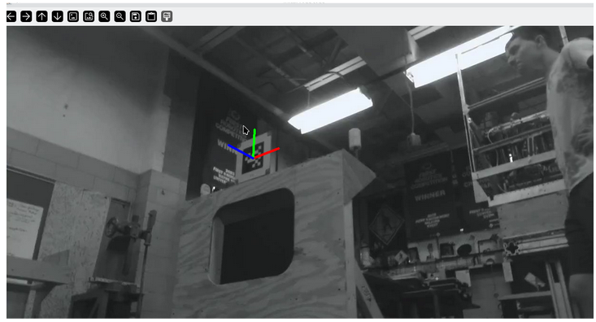

I’m trying to convert the sovlepnp rvec and tvec output to wpilib field coords (like field to camera transform) so they are actually useful.

I copied all of the relevant code from Polaris but something in the chain isn’t working, ill walk through it.  
That being true, the most obvious explanation would be that the tvec and rvec themselves are off, but if I do drawFrameAxes:  
It looks completely fine? 

Then the code to convert it to a wpilib pose is this, stolen exactly from polaris and northstar:  
```python
field_to_tag_pose = tag_poses[0]
camera_to_tag_pose_0 = openCVPoseToWPILib(tvecs[0], rvecs[0]) 
camera_to_tag_0 = Transform3d(camera_to_tag_pose_0.translation(), camera_to_tag_pose_0.rotation())

field_to_camera_0 = field_to_tag_pose.transformBy(camera_to_tag_0.inverse())
field_to_camera_pose_0 = Pose3d(field_to_camera_0.translation(), field_to_camera_0.rotation())
```
I'll go through the output of each of these lines:

**field\_to\_tag\_pose**   
`Pose3d(Translation3d(x=1.841500, y=8.204200, z=1.355852), Rotation3d(x=0.000000, y=0.000000, z=-1.570796))`

This number is correct, it's just taken from the atfl json file so its the most difficult to mess up  
**camera\_to\_tag\_pose\_0**
`Pose3d(Translation3d(x=2.660625, y=0.237158, z=0.137607), Rotation3d(x=-2.874303, y=-0.340958, z=2.417726))`

Already this seems wrong, for now I’ve been ignoring rotation, but the translation assumes the apriltag is 0.137 m above the camera if I’m reading it correctly? That is obviously not true which you can see in the photo, the camera is about 0.23m off the ground in reality for reference  
I’m not sure why this number would be wrong, the only modification that's being made is openCVPoseToWPILib, which, guess what, is directly stolen from polaris as well.

```python
def openCVPoseToWPILib(tvec: np.typing.NDArray[np.float64], rvec: np.typing.NDArray[np.float64]) -> Pose3d:  
   return Pose3d(  
       Translation3d(tvec[2][0], -tvec[0][0], -tvec[1][0]),  
       Rotation3d(  
           numpy.array([rvec[2][0], -rvec[0][0], -rvec[1][0]]),  
           math.sqrt(  
               math.pow(rvec[0][0], 2)  
               + math.pow(rvec[1][0], 2)  
               + math.pow(rvec[2][0], 2)  
           ),  
       ),  
   )
```

Maybe it is correct, and I’m understanding it wrong, so I’ll continue:  
**camera\_to\_tag\_0**  
`Transform3d(Translation3d(x=2.660625, y=0.237158, z=0.137607), Rotation3d(x=-2.874303, y=-0.340958, z=2.417726))`  
No surprises here  
**field\_to\_camera\_0**  
`Pose3d(Translation3d(x=0.167035, y=6.519520, z=2.585537), Rotation3d(x=3.124314, y=0.429666, z=0.889441))`  
This is wrong but it makes sense with what we gave it, camera_to_tag_0.inverse() is `Transform3d(Translation3d(x=1.684680, y=-1.674465, z=1.229685), Rotation3d(x=3.124314, y=0.429666, z=2.460237))`
